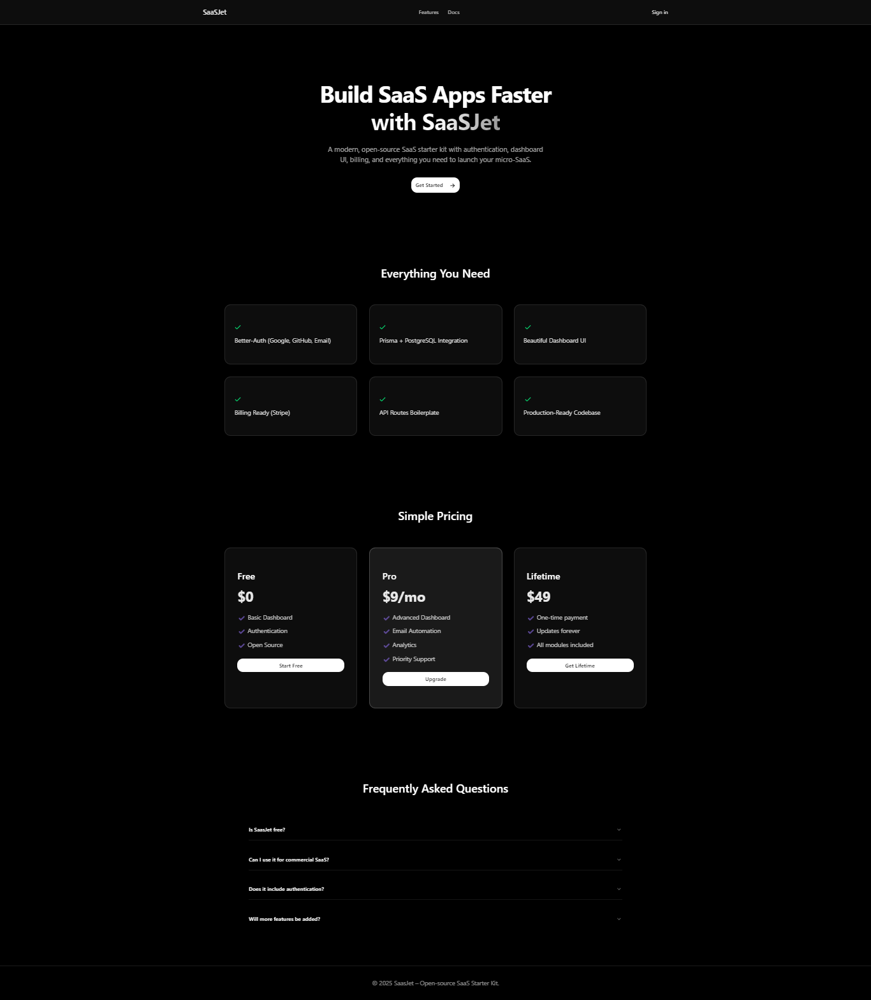

# **SaaSJet** 🚀

**A lean, production-ready open-source SaaS boilerplate** that lets you launch your idea in days, not weeks built with modern tools, minimal overhead, and real-world priorities in mind.

We built SaaSJet because most boilerplates either drown you in unnecessary complexity (like forced multi-tenancy or enterprise-scale features) or leave critical pieces missing. This one focuses on what actually matters for indie hackers and solo founders shipping a paid product: secure auth, reliable billing, a polished dashboard, and a solid foundation you can deploy today. No upsell to a "pro" version everything here is free and open-source under MIT.



# **Why SaaSJet Stands Out**

After researching dozens of open-source Next.js SaaS boilerplates, we found many great options, but SaaSJet differentiates by staying intentionally minimal while being fully functional. Here's how it compares to popular alternatives:

1. [Vs. ixartz/SaaS-Boilerplate](https://github.com/ixartz/SaaS-Boilerplate): Robust with multi-tenancy and advanced features, but can feel heavy. SaaSJet keeps it lightweight no forced extras, pure Prisma, and native Stripe without premium lock-in.

2. [Vs. mickasmt/next-saas-stripe-starter](): Great with roles and emails, but includes more opinionated additions. SaaSJet strips down to essentials for faster customization.

3. [Vs. Official Next.js SaaS Starter](): Solid basics, but often pairs with Drizzle/Supabase. SaaSJet uses Prisma + PostgreSQL for maximum flexibility and type-safety.

If you're tired of over-engineered starters that slow you down, SaaSJet gets you to MVP without the fluff.

# **Key Features✨**

- ### **Authentication**

  Ready-to-go social login with Google and GitHub, plus magic-link/email-password support (powered by NextAuth.js)

- ### **Database**

  Prisma ORM with PostgreSQL full schema, migrations, and type-safe
  queries out of the box

- ### **UI & Dashboard**

  Beautiful, responsive admin dashboard built with Tailwind CSS and shadcn/ui components no need to start from a blank page

- ### **Billing & Subscriptions**

  Stripe integration pre-configured: checkout sessions, customer portal, webhooks, and subscription management

- ### **API Layer**

  Organized API routes (Next.js App Router) with examples for protected endpoints, rate limiting, and error handling

- ### **Production-Ready from Day 1**

  Environment configuration, TypeScript strict mode, ESLint + Prettier, even Docker support (coming soon), and easy deployment to Vercel, Railway, or any Node.js host


# **Features Guides**

Dive deeper into SaaSJet's core features with these step-by-step guides. Each one walks you through setup, code examples, and best practices straight from the boilerplate's real implementation.

- [**Getting Started with Next.js 16+: A Simple Setup Guide with Tailwind CSS**](https://saasjet.vercel.app/docs/getting-started-with-nextjs)<br/>Set up a clean, production-ready Next.js 16+ app with Tailwind CSS in minutes the exact foundation used in SaaSJet.

- [**Integrating Stripe Subscriptions in Next.js with Webhooks**](https://saasjet.vercel.app/docs/integrating-stripe-subscriptions)<br/>Step-by-step guide to adding one-time and recurring payments using Stripe, including secure webhook handling.

- [**BetterAuth Setup in Next.js for SaaS Solutions**](https://saasjet.vercel.app/docs/better-authentication-setup)<br/>Implement secure, scalable authentication with email/password, social logins, magic links, and role-based access pre-configured and ready to customize in SaaSJet.

- [**Database Setup with Prisma ORM and PostgreSQL**](https://saasjet.vercel.app/docs/setting-up-prisma-postgresql)<br/>Connect Prisma to PostgreSQL, define models, and run migrations the scalable database setup in SaaSJet.

More guides coming soon check out the full [Docs & Blog](https://saasjet.vercel.app/docs) for updates.

# **Quick Start**

### 1. Clone the repository

```bash
git clone https://github.com/yourusername/saasjet.git
cd saasjet
```

### 2. Install dependencies

```bash
bun install

# or
npm install

# or
pnpm install
```

### 3. Copy the example environment file and fill in your values

```bash
cp .env.example .env.local
```

- Required variables

```bash
# base Urls & secrets
BETTER_AUTH_SECRET=...
BETTER_AUTH_URL=...
NEXT_PUBLIC_APP_URL=...

# Database
DATABASE_URL=postgresql...

# Auth
GITHUB_ID=...
GITHUB_SECRET=...
GOOGLE_CLIENT_ID=...
GOOGLE_CLIENT_SECRET=...

# stripe
STRIPE_PUBLISHABLE_KEY=...
STRIPE_SECRET_KEY=...
STRIPE_PRICE_PRO=...
STRIPE_PRICE_LIFETIME=...
STRIPE_WEBHOOK_SECRET=...
```

### 4. Run database migrations

```bash
npx prisma migrate dev
```

### 5. Start the development server

```bash
npm run dev
```

- Open <http://localhost:3000> -> log in, explore the dashboard, and start building your product.

# **Contributing🌟**

SaaSJet is open-source because we believe the best tools grow through community feedback.

- Found a bug or have a suggestion? Open an issue.

- Want to add a feature or improve something? Fork the repo and submit a pull request.

- Every contribution helps other founders ship faster thank you!

Built with ❤️ for indie hackers, solo founders, and small teams who want to move fast and ship real products.

_Launch your SaaS. Solve real problems. Win._

### Follow me on X -> [hasnainXdev](https://x.com/hasnainXdev)
